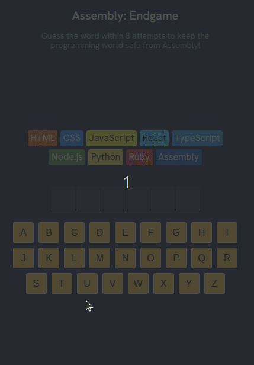

# Assembly: Endgame 🎮

[](https://choosealicense.com/licenses/mit/)
[](https://reactjs.org/)
[](https://vitejs.dev/)
[](https://developer.mozilla.org/en-US/docs/Web/JavaScript)

A thrilling word-guessing game where you must save the programming world from Assembly language domination! Guess the hidden word within 8 attempts to keep your favorite programming languages alive.

## Table of Contents

- [Overview](#overview)
- [Features](#features)
- [Demo](#demo)
- [Installation](#installation)
- [Usage](#usage)
- [Game Rules](#game-rules)
- [Technical Details](#technical-details)
- [Contributing](#contributing)
- [License](#license)
- [Acknowledgments](#acknowledgments)

## Overview

Assembly: Endgame is an interactive word-guessing game built with React and Vite. Players must guess a random word letter by letter before running out of attempts. Each wrong guess eliminates a programming language from the world, starting with HTML and ending with the dreaded Assembly language taking over!

## Features

✨ **Interactive Gameplay**
- Random word selection from a curated list of 400+ words
- Letter-by-letter guessing mechanics
- Visual feedback for correct and incorrect guesses

🎨 **Rich Visual Experience**
- Colorful programming language chips with unique themes
- Animated confetti celebration on victory
- Dynamic visual states (won/lost/farewell messages)
- Responsive design for all screen sizes

♿ **Accessibility First**
- Full keyboard navigation support
- Screen reader compatible with ARIA labels
- Live status updates for assistive technologies
- High contrast color scheme

🎯 **Game Features**
- 8 attempts maximum (one for each programming language)
- Humorous farewell messages when languages are eliminated
- New game functionality to restart instantly
- Word reveal on game over

## Demo



## Installation

### Prerequisites

- Node.js (version 14 or higher)
- npm or yarn package manager

### Setup

1. **Clone the repository**
   ```bash
   git clone https://github.com/bakadja/assembly-endgame.git
   cd assembly-endgame
   ```

2. **Install dependencies**
   ```bash
   npm install
   ```

3. **Start the development server**
   ```bash
   npm start
   ```

4. **Open your browser**
   Navigate to `http://localhost:5173` to play the game!

## Usage

### Development Commands

```bash
# Start development server
npm start
# or
npm run dev

# Build for production
npm run build

# Preview production build
npm run preview
```

### Playing the Game

1. **Start the Game**: Open the application in your browser
2. **Read the Word**: Look at the blank spaces representing the hidden word
3. **Guess Letters**: Click on keyboard buttons to guess letters
4. **Track Progress**: Watch as programming languages disappear with wrong guesses
5. **Win or Lose**: Guess the word before Assembly takes over, or face defeat!
6. **Play Again**: Click "New Game" to start fresh with a new word

## Game Rules

- **Objective**: Guess the hidden word before making 8 incorrect guesses
- **Attempts**: You have 8 chances (one for each programming language)
- **Feedback**: 
  - Green letters are correct and in the word
  - Red letters are incorrect
  - Used letters are disabled
- **Victory**: Guess all letters in the word to win with confetti!
- **Defeat**: Make 8 wrong guesses and Assembly takes over the programming world

### Programming Languages (in elimination order):
1. HTML
2. CSS  
3. JavaScript
4. React
5. TypeScript
6. Node.js
7. Python
8. Ruby
9. Assembly (the final boss!)

## Technical Details

### Built With

- **React 18.3.1** - UI framework
- **Vite** - Build tool and development server
- **CSS3** - Styling and animations
- **React Confetti** - Victory celebration effects
- **clsx** - Conditional CSS class management

### Project Structure

```
assembly-endgame/
├── App.jsx           # Main game component
├── index.jsx         # React app entry point
├── languages.js      # Programming language data
├── words.js          # Word bank for the game
├── utils.js          # Utility functions
├── index.css         # Global styles
├── index.html        # HTML template
├── vite.config.js    # Vite configuration
└── package.json      # Project dependencies
```

### Key Components

- **AssemblyEndgame**: Main game component handling all game logic
- **Language Chips**: Visual representation of remaining programming languages
- **Keyboard**: Interactive letter selection interface
- **Word Display**: Shows guessed letters and blanks
- **Game Status**: Displays win/lose/farewell messages

## Contributing

We welcome contributions to make Assembly: Endgame even better! Here's how you can help:

### Getting Started

1. Fork the repository
2. Create a feature branch (`git checkout -b feature/amazing-feature`)
3. Make your changes
4. Commit your changes (`git commit -m 'Add amazing feature'`)
5. Push to the branch (`git push origin feature/amazing-feature`)
6. Open a Pull Request

### Contribution Ideas

- 🎨 Add new visual themes or animations
- 📝 Expand the word database
- 🌍 Add internationalization support
- 🎵 Include sound effects
- 📱 Improve mobile responsiveness
- ♿ Enhance accessibility features

### Code Style

- Use consistent formatting (Prettier recommended)
- Follow React best practices
- Include comments for complex logic
- Ensure accessibility compliance

## License

This project is licensed under the MIT License - see the [LICENSE](LICENSE) file for details.

## Acknowledgments

- **Scrimba** - For the original project foundation and educational content
- **Vite Team** - For the excellent build tool and development experience
- **React Community** - For the robust ecosystem and documentation
- **Word List Contributors** - For curating the comprehensive word database

---

**Ready to save the programming world?** 🚀 [Start playing now!](https://)

*Built with ❤️ and lots of ☕ by developers who love word games*